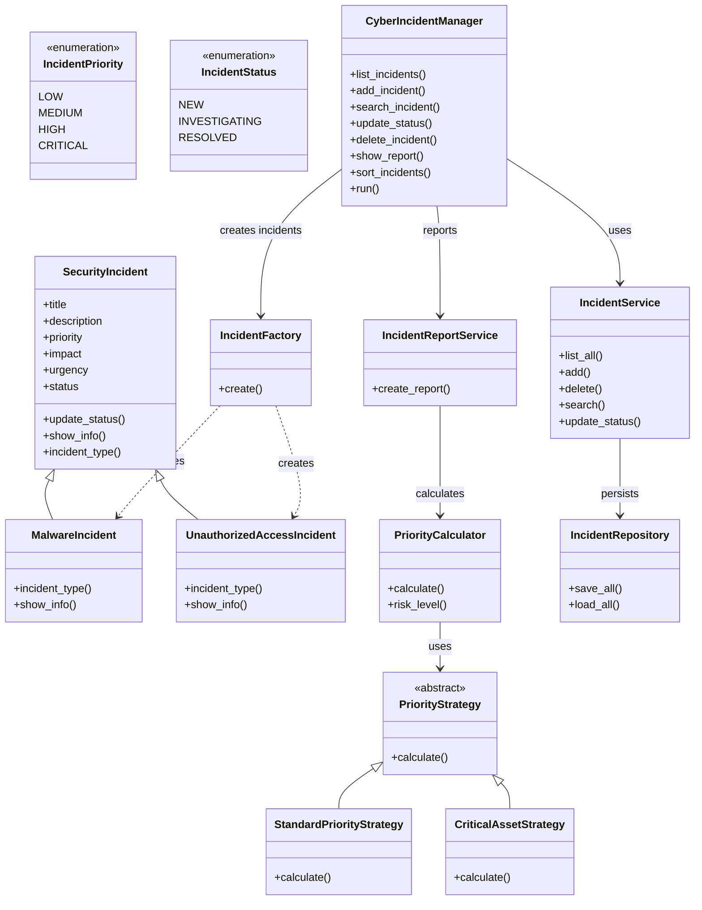

# Cyber Incident Manager - UML Class Diagram

```mermaid
classDiagram
    class SecurityIncident {
        +title
        +description
        +priority
        +impact
        +urgency
        +status
        +update_status()
        +show_info()
        +incident_type()
    }

    class MalwareIncident {
        +incident_type()
        +show_info()
    }

    class UnauthorizedAccessIncident {
        +incident_type()
        +show_info()
    }

    class IncidentPriority {
        <<enumeration>>
        LOW
        MEDIUM
        HIGH
        CRITICAL
    }

    class IncidentStatus {
        <<enumeration>>
        NEW
        INVESTIGATING
        RESOLVED
    }

    class IncidentFactory {
        +create()
    }

    class PriorityStrategy {
        <<abstract>>
        +calculate()
    }

    class StandardPriorityStrategy {
        +calculate()
    }

    class CriticalAssetStrategy {
        +calculate()
    }

    class PriorityCalculator {
        +calculate()
        +risk_level()
    }

    class IncidentRepository {
        +save_all()
        +load_all()
    }

    class IncidentService {
        +list_all()
        +add()
        +delete()
        +search()
        +update_status()
    }

    class IncidentReportService {
        +create_report()
    }

    class CyberIncidentManager {
        +list_incidents()
        +add_incident()
        +search_incident()
        +update_status()
        +delete_incident()
        +show_report()
        +sort_incidents()
        +run()
    }

    SecurityIncident <|-- MalwareIncident
    SecurityIncident <|-- UnauthorizedAccessIncident
    PriorityStrategy <|-- StandardPriorityStrategy
    PriorityStrategy <|-- CriticalAssetStrategy

    IncidentFactory ..> MalwareIncident : creates
    IncidentFactory ..> UnauthorizedAccessIncident : creates
    PriorityCalculator --> PriorityStrategy : uses
    IncidentService --> IncidentRepository : persists
    IncidentReportService --> PriorityCalculator : calculates
    CyberIncidentManager --> IncidentService : uses
    CyberIncidentManager --> IncidentFactory : creates incidents
    CyberIncidentManager --> IncidentReportService : reports
```
